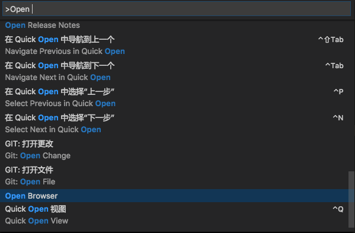

# browser-plus README

## 在编辑器内预览HTML

通过开启端口(3000)监听当前打开项目的根目录，在编辑器内预览网站，省去了频繁切换浏览器、编辑器看页面效果，修改代码后自动刷新页面。

## 使用方法

选择 `Open Browser`

## 快捷键

* Window `Ctrl+F1`
* Mac `Cmd+F1`

## TODO

- [x] 添加配置选项

- [ ] ~~实现浏览器前进、后退功能~~

## 说明

该插件只是根据个人实际开发遇到的问题或者说是个需来开发的，同时也是初学插件开发，所以效果很简陋，也只能用来个人把玩！希望大家来[吐槽](https://github.com/bobjoy/vscode-browser-plus/issues)^_^
